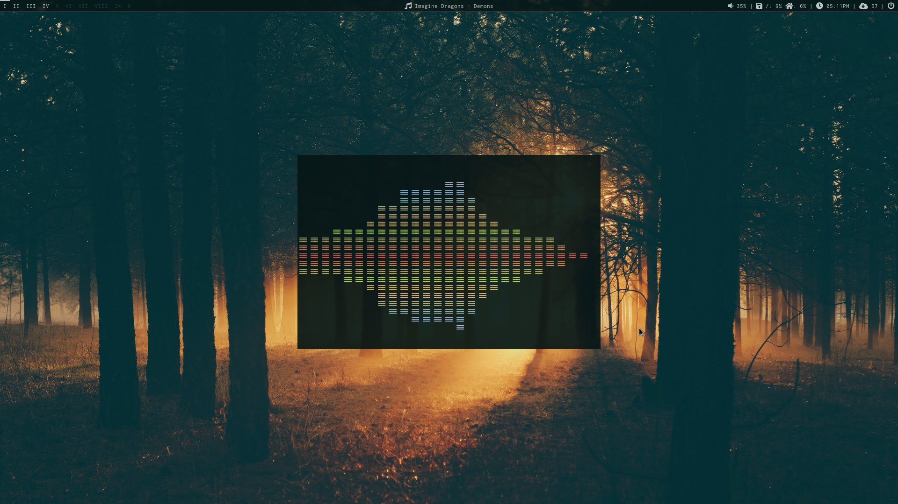
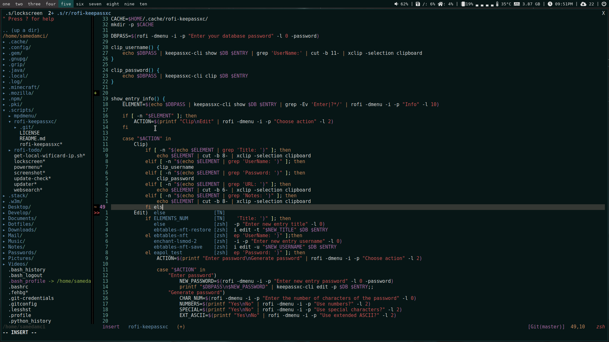

```bash
 _      _                _                        __
| |__  (_) _   _   __ _ | |    ___  ___   _ __   / _|
| '_ \ | || | | | / _` || |   / __|/ _ \ | '_ \ | |_
| |_) || || |_| || (_| || | _| (__| (_) || | | ||  _|
|_.__/ |_| \__,_| \__,_||_|(_)\___|\___/ |_| |_||_|
```
**B**tw. **I** **u**se **A**rch **L**inux

# Screenshots



## Hot stuff:
Category | Item
:--- | :---
os | parabola
wm | bspwm
shortcuts manager | sxhkd
browser | icecat
shell | zsh
bar | polybar
text editor | neovim
bittorrent client | transmission-cli
password manager | keepassxc
compositor | picom
notify daemon | dunst
music daemon | mpd
music player | ncmpcpp
app menu | rofi
aur helper | yay
audio drivers | alsa
terminal emulator | st
video player | vlc/mpv
ascii generator | figlet
file manager | vifm
mail client | neomutt

+ some personal scripts for rofi and dmenu
